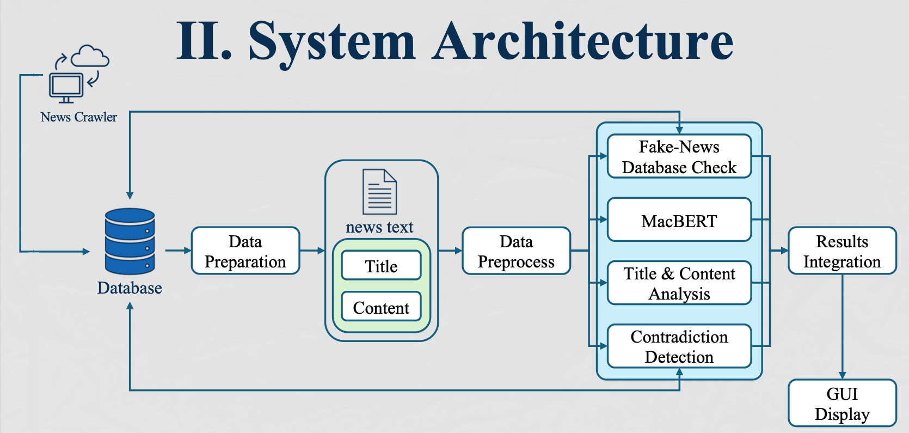
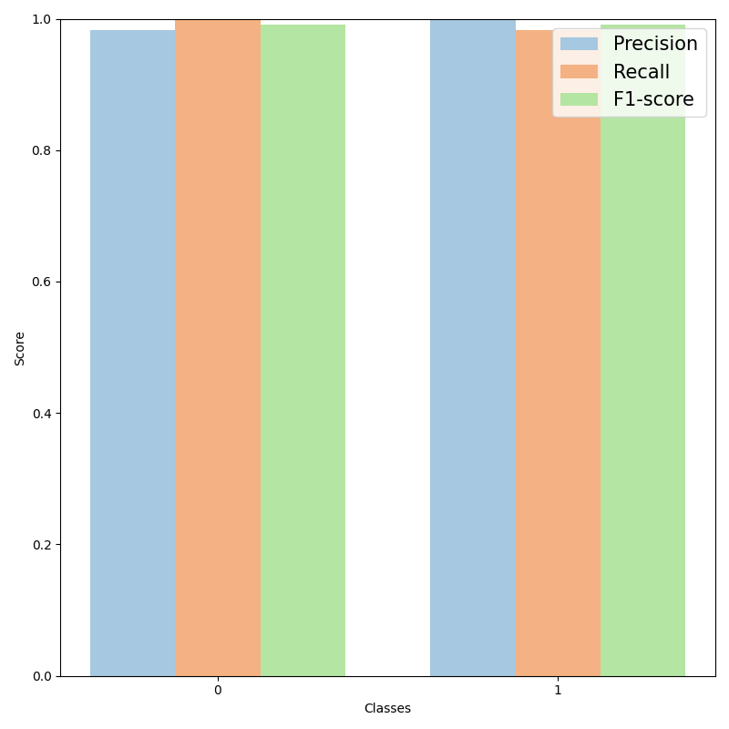

<p align="center">
  <a href="https://www.python.org/downloads/"></a>
  <a href="LICENSE"></a>
  <a href="https://huggingface.co/spaces/yachiashen/DeFake-ZH">
  </a>
</p>

<p align="center">
  
</p>

<h1 align="center">Chinese Fake News Detection based on MacBERT</h1>

<p align="center">
  <span style="font-size:small; color:gray;">
    A deep learning–powered system for probabilistic fake news detection in Chinese-language news
  </span>
</p>

## Overview
**DeFake-ZH** is a deep learning–based system for Chinese fake news detection, integrating **MacBERT**, **MGP Database Matching**, and **Contradiction Detection**.  
Trained on over **390k news articles (Sept. 2024–May 2025)**, the system achieves **99.12% accuracy** and **0.9912 F1-score**, outperforming previous studies.

---

## System Architecture

<p align="center">
  
</p>
<p align="center"><em>Figure: Overall system architecture of DeFake-ZH</em></p>

- **News Crawler**: collects verified and unverified articles from mainstream Taiwanese media and fact-checking organizations.  
- **Data Preparation**: splits each article into **Title** and **Content** fields for subsequent analysis.  
- **Preprocessing**: text cleaning, deduplication, Chinese tokenization, and embedding extraction.  
- **Detection Modules**:
  - **MacBERT + MLP Classifier**: supervised classification using contextual embeddings.
  - **Database Matching**: compares input with verified/fake entries in the MGP database.
  - **Contradiction Detection**: checks logical contradictions via knowledge triplets and Natural Language Inference (NLI).  
  - **LLM-Scored Features**: headlines scored by **LLaMA 3.1-8B-Instruct** for sentiment, subjectivity, and extreme expressions. These features enhance interpretability and help detect implicit disinformation.
- **GUI Interface**: interactive system for quick and full analysis, providing probability scores with expandable interpretability reports.

---

## Methodology

### (a) Database Construction
- **Sources**: see [Dataset](#dataset) for full list of news outlets and fact-checking references.  
- Articles: over **390k** (verified + unverified).  
- Additional scoring: **LLaMA 3.1-8B-Instruct** used to generate auxiliary labels on tone and sentiment.

### (b) Data Preparation
- Extract **title** and **content**.  
- Normalize and structure for downstream processing.

### (c) Preprocessing
- Text cleaning.  
- Duplicate removal.  
- Chinese word segmentation.  
- Embedding extraction via **MacBERT**.

### (d) Detection Modules
1. **MacBERT Embedding + MLP Classifier** – supervised classification using contextual embeddings.  
2. **Database Matching** – checks for matches with known fake or verified news. High similarity provides strong signals.  
3. **Contradiction Detection** – detects inconsistencies with known facts using triplet extraction / natural language inference (NLI).  
4. **LLM-Scored Features** – evaluates sentiment, subjectivity, and provocative tone, displayed in GUI for interpretability.  

---

## Experimental Results

**Figure:** Experimental results comparing two settings. (Left) MGP-only baseline. (Right) MGP+MacBERT.

<p align="center">
  
  
</p>


| System            | Precision | Recall  | F1-score | Accuracy |
|-------------------|-----------|---------|----------|----------|
| Only MGP          | 0.8421    | 0.7908  | 0.7827   | 0.7908   |
| **MGP + MacBERT** | **0.9913**| **0.9912**| **0.9912** | **0.9912** |

- **Only-MGP**: High precision (97.45%) for fake
news detection, but low recall (59.72%), leading to poor balance and indicating a high miss rate, which lowers the overall accuracy to 79.08%.  
- **MGP+MacBERT**: Balanced across all metrics, achieving **>99%** consistently.  

## Literature Comparison

|                | **THIS PROJ.** | [1] | [2] |
|----------------|------------|-----|-----|
| **Language**   | Chinese    | Chinese | Chinese |
| **Method**     | MacBERT    | Keras Sequential | BERT |
| **Accuracy**   | 99.12%     | 90.53% | - |
| **F1-score**   | 0.9912     | -   | 0.6701 |

The proposed system achieved an accuracy of 99.12% and an F1-score of 0.9912,
clearly outperforming prior studies.  
In particular, [2] (Lin, 2021) applied a BERT-based model to classify CoFacts
data into binary categories, achieving a best-case Macro-F1 score of 0.6701.

- [1] [Wang et al. (2021). *Empirical Research on Fake News Detection Using AI Technology*.](https://www.airitilibrary.com/Article/Detail/17263581-N202403090016-00003)
- [2] [Lin (2021). *Exploring Artificial Intelligence Technologies for Fake News Detection*.](https://hdl.handle.net/11296/g3reqt)

---

## Dataset

⚠️ Due to copyright restrictions, the dataset is **not distributed with this repository**.  
Users may collect comparable data from the listed sources and fact-checking organizations.  
Or contact us for further information regarding data access.

### News Sources

Collected news data come from a variety of Taiwanese media outlets:

- [`CNA`](https://www.cna.com.tw/), [`CTS`](https://news.cts.com.tw/), [`FTV`](https://www.ftvnews.com.tw/), [`LTN`](https://news.ltn.com.tw/), [`Mirror Media`](https://www.mirrormedia.mg/), [`PTS`](https://news.pts.org.tw/), [`SETN`](https://www.setn.com/), [`TTV`](https://www.ttv.com.tw/), [`TVBS`](https://news.tvbs.com.tw/), [`UDN`](https://udn.com/)  

The dataset includes the following classification labels:

- `entertain_sports` – Entertainment & Sports
- `international` – International News
- `local_society` – Local & Society
- `politics` – Politics
- `technology_life` – Technology & Life

### Fact-checking References

DeFake-ZH is also informed by fact-checking resources from trusted Taiwanese organizations:

- [`MyGoPen (MGP)`](https://www.mygopen.com/)
- [`Taiwan FactCheck Center (TFC)`](https://tfc-taiwan.org.tw/)

---

## Project Structure

### `data/`
```bash
data/
├── db/          # Reference DBs/indexes (.json/.pkl/.faiss)
├── features/    # Extracted feature tensors (.npy/.pt)
├── processed/   # Cleaned and split data (train/val/test)
└── raw/         # Raw CSV/JSON news data
```

### `models/`
```bash
models/
├── bge-m3/                  # Sentence embeddings (BAAI/bge-m3)
├── chinese-macbert-large/   # Chinese MacBERT (hfl/chinese-macbert-large)
├── ltp/                     # HIT-SCIR LTP models
├── task/                    # Task-specific classifier
├── text2vec/                # Chinese sentence embeddings
├── word2vec/                # Chinese word embeddings
└── README.md
```

### `src/`
```bash
src/
├── gui.py                # Gradio app entry point (Blocks UI & events)
├── interface.py          # Pipeline orchestrator (single-/multi-machine; helper clients)
├── otherGUI.py           # Shared GUI components & CSS hooks
├── scores.py             # Scoring & summary rendering
├── mgpSearch.py          # MGP database search (sentence similarity, OpenCC, threshold≈0.75)
├── contradiction.py      # Triplet extraction (LTP) + NLI contradiction checks (with caching)
├── classifier.py         # PyTorch MLP classifier + metrics
├── trainClassifier.py    # Training script
├── buildDatabase.py      # DB/index builder (merge, sentence split, triplets)
├── dataPreparation.py    # Cleaning, deduplication, tokenization, splits
├── featureEngineering.py # Embedding/feature pipelines (MacBERT/BGE/Text2Vec/Word2Vec)
├── PU_Learning.py        # PU learning: initial labeling with TF‑IDF + logistic regression
├── helper.py             # Helper server runner (contrad/MGP) for remote calls
├── const.py              # Global constants and canonical paths
└── nodes.py              # Embedding & vector store utils (FAISS, LangChain docs)
```

### `tests/`
```bash
tests/
├── predict_single_news.py   # Single‑news prediction demo
├── testMLP.py               # Plot training/validation curves for MLP
└── testAll.py               # Analyze results: confusion matrices & PR/F1 across phases
```

---

## Installation

### 1. Clone repository
```bash
git clone https://github.com/yachiashen/DeFake-ZH.git
cd DeFake-ZH
git lfs install
git lfs pull
```

> #### Note: Git LFS
> This repository uses **Git LFS** to manage large files (e.g., models, databases).  
> Please make sure you have [Git LFS](https://git-lfs.com/) installed:
>
> ```bash
> # Install Git LFS (only once per system)
> git lfs install
> 
> # After cloning the repository, fetch large files
> git lfs pull
> ```

### 2. Create environment
```bash
conda env update -f environment.yml --prune
conda activate defake-zh
pip install -r requirements.txt
```

### 3. Download / Prepare models
- `chinese-macbert-large`: auto-download via Hugging Face `transformers`
- Others (`bge-m3`, `ltp`, `word2vec`, `text2vec`, `task`): download manually as described in [models/README.md](models/README.md)

> Ensure the models/ directory and its subfolders exist before running.

---

## Usage

### Launch Gradio interface
```bash
cd src
python gui.py
```

After launching, Gradio will display a local URL in the terminal (e.g., `http://127.0.0.1:7860/`).  
Open it in your browser, enter a **News Title** and **News Content**, then choose **Quick Analysis** or **Full Analysis**.

- The system outputs:  
  - Database matches  
  - Contradiction detection results  
  - MacBERT classification with sentence-level scores  
  - Final summary (expandable for detailed interpretability)

> Or try it online (with limited functionality): [DeFake-ZH on Hugging Face Spaces](https://huggingface.co/spaces/yachiashen/DeFake-ZH)


<!-- - Visit http://127.0.0.1:7860/
- Input **News Title** and **News Content**
- Choose **Quick Analysis** or **Full Analysis**
- Outputs:  
  1) MGP database results  
  2) Contradiction detection  
  3) MacBERT classification + sentence-level scores  
  4) Final summary (with expandable detailed analysis) -->

---

## Contributors

- [@MingMinNa](https://github.com/MingMinNa)  
- [@yachiashen](https://github.com/yachiashen)  

---

## Note
This project was carried out as part of the **Undergraduate Capstone Project** at the Department of Computer Science and Information Engineering, NCKU, 2025.

---

## Acknowledgements
[**Prof. Fan-Hsun Tseng**](https://sites.google.com/site/fanhsuntseng/),  
for his guidance and supervision throughout the project.

---

## License

[MIT License](LICENSE)

> All news articles are copyrighted by their original publishers and fact-check platforms. Please comply with their usage policies.
