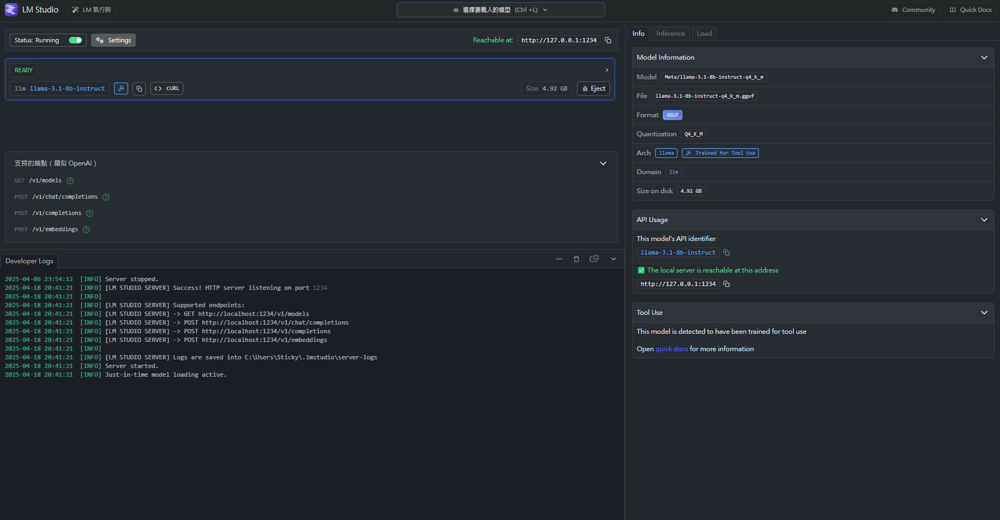

## dataset_generator 資料夾說明

資料集是透過 **[llama3.1-8B-Instruct](https://huggingface.co/M0711/Llama-3.1-8B-Instruct-Q4_K_M-GGUF/tree/main)** 大語言模型生成。  
此外，透過 **[LM Studio](https://lmstudio.ai/)** 提供的本地伺服器功能來執行此語言模型，使得程式能以 **OpenAI API** 的格式與模型互動。

#### LM Studio 本地伺服器運行圖示
